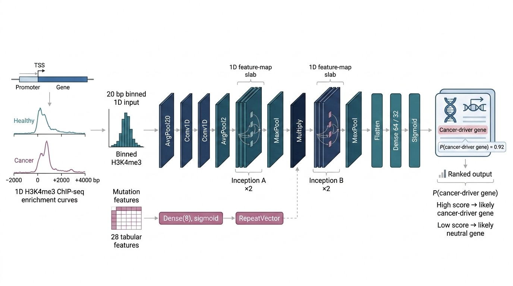

# OriGENE

**Cancer gene classification using deep convolutional neural networks on epigenetic marker enrichment profiles**

[](https://opensource.org/licenses/MIT)
[](https://snakemake.readthedocs.io)
[](https://www.python.org/)

> **Authors:** Marc Pielies-Avelli, Ming-Heng Hsiung, Dr. Alin S. Tomoiaga, Dr. Mattias Ohlsson, Dr. Victor Olariu

---

## Overview

OriGENE is a deep learning framework that predicts cancer driver genes from histone modification enrichment profiles. By training a 1D convolutional neural network on ChIP-seq signals around gene regions, OriGENE primarily distinguishes **cancer driver genes (CD)** from **normal genes (NG)**, with performance validated against curated cancer gene reference sets.

**Key capabilities:**

- End-to-end Snakemake workflows for reproducible data acquisition and preprocessing
- Multi-track epigenetic input supporting cancer and normal tissue comparisons
- Mutation feature integration for the mutation-aware branch
- Inception-style CNN architecture for cancer gene classification

---

## Architecture Overview



*Figure 1. Simplified conceptual overview of the OriGENE architecture and its extended mutation-aware branch.*

---

## Repository Structure

```text
OriGENE_published/
|- epigenetic_snakemake_pipline/      # ChIP-seq preprocessing workflow
|- mutation(VCF)_snakemake_pipeline/  # VCF generation workflow
|- mutation_feature_pipeline/         # Mutation feature extraction
|- Data/                              # Gene lists, reference files, saved outputs
|- assets/                            # Figures and other repository media
|- Tables/                            # Output summary tables
|- OriGENE_main_code.ipynb            # Main model: training, evaluation, visualization
|- OriGENE_mutation_branch.ipynb      # Mutation-aware model variant
|- Data-visualization.ipynb           # Exploratory analysis and figures
|- Epigenetics_newgenes.py            # Gene-level signal extraction helper
|- envs/                              # Notebook environment
`- Readme.md
```

---

## Biological Background

Post-translational histone modifications reshape chromatin accessibility and regulate transcription. Promoter-proximal H3K4me3 enrichment marks actively transcribed genes, while other histone marks help define active or poised regulatory regions. Aberrant patterns of these marks are a hallmark of oncogenic transformation.

OriGENE exploits the fact that cancer driver genes exhibit systematically different epigenetic landscapes compared to neutral genes, enabling CD-versus-NG classification from enrichment profiles alone.

**Main labels used in the project:**

| Label | Definition |
|---|---|
| CD | Cancer driver |
| NG | Normal gene (non-driver) |

OG and TSG remain useful biological background categories in the source annotations, but the main training setup in this repository is centered on CD versus NG labels.

---

## Pipeline Overview

The full workflow consists of five stages. Each stage can be reproduced independently.

```text
Raw sequencing data -> Alignment and preprocessing -> Gene-level tracks -> CNN training -> Classification
```

---

## Installation

**Dependencies:**

The preprocessing pipelines provide their own environments.  
For the OriGENE model notebooks, use:

```bash
conda env create -f envs/origene-model.yaml
conda activate origene-model
python -m ipykernel install --user --name origene-model --display-name "Python (origene-model)"
```

**Clone the repository:**

```bash
git clone https://github.com/<org>/OriGENE.git
cd OriGENE
```

---

## Workflows

### 1. Epigenetic data acquisition (`epigenetic_snakemake_pipline/`)

Downloads or prepares ChIP-seq input, aligns to hg38, and produces sorted bedGraph signal files.

```bash
cd epigenetic_snakemake_pipline
snakemake -s workflow/Snakefile -p --use-conda -j 6
```

**Processing steps (automated):**

| Step | Tool | Output |
|---|---|---|
| Input preparation | SRA toolkit / FASTQ input | `.fastq.gz` |
| Align | `bowtie2` | sorted `.bam` |
| Deduplicate | `samtools rmdup` | deduplicated `.bam` |
| Coverage | `bedtools genomecov` | `.bedGraph` |
| Sort | UCSC / sorting step | `.bedgraph.sorted` |

### 2. Mutation feature pipeline (`mutation_feature_pipeline/`)

Processes VCF files into per-gene mutation-derived features for the mutation-aware branch of OriGENE.

```bash
cd mutation_feature_pipeline
snakemake -s workflow/Snakefile --configfile config/config.yaml --use-conda --cores 4
```

If you need to generate VCF files first, use the upstream workflow in `mutation(VCF)_snakemake_pipeline/`.

### 3. Gene-level track extraction

Split chromosome-level signal files into fixed-width windows around genes using `Epigenetics_newgenes.py` and the metadata in `Data/diagnostic_file.tsv`.

Example:

```python
from Epigenetics_newgenes import create_txt

create_txt(
    Diagnostic_file="Data/diagnostic_file.tsv",
    PATH="path/to/chromosome_files/",
    outPATH="path/to/gene_tracks/",
    shift=2000,
)
```

Output filenames encode metadata such as dataset, sample, marker, gene, strand, and label.

### 4. Preprocessing

Run inside `OriGENE_main_code.ipynb`:

- zero-padding or cropping to uniform length,
- handling missing signal positions,
- reshaping to model input tensors,
- train, validation, and test partitioning.

### 5. Model training and evaluation

Open and run `OriGENE_main_code.ipynb`.  
For the mutation-aware variant, use `OriGENE_mutation_branch.ipynb`.

---

## Model Architecture

OriGENE processes 1D epigenetic signal sequences through three functional blocks:

**Input encoding**

- Fixed-length genomic signal windows
- One or more parallel tracks
- Early pooling to reduce dimensionality

**Feature extraction**

- Stacked 1D convolutional layers
- Inception-style modules for multi-scale feature extraction
- Repeated pooling for progressive compression

**Classification head**

- Flatten layer
- Fully connected layers
- Final sigmoid output for cancer-driver prediction

---

## Key References

- Jie Lyu et al. (2020). *Genome-wide identification of cancer drivers.* Science Advances. https://doi.org/10.1126/sciadv.aba6784
- Cancer Gene Census: https://cancer.sanger.ac.uk/census
- UCSC Genome Browser: https://genome.ucsc.edu/

---

## Glossary

| Term | Definition |
|---|---|
| TSS | Transcription start site |
| CD | Cancer driver |
| NG | Normal gene (non-driver) |
| ChIP-seq | Chromatin immunoprecipitation sequencing |
| bedGraph | Genome coverage format |

---

## License

This project is licensed under the MIT License. See `LICENSE` for details.

---

## Citation

If you use OriGENE in your research, please cite the associated thesis, paper, or software record accompanying this repository.
